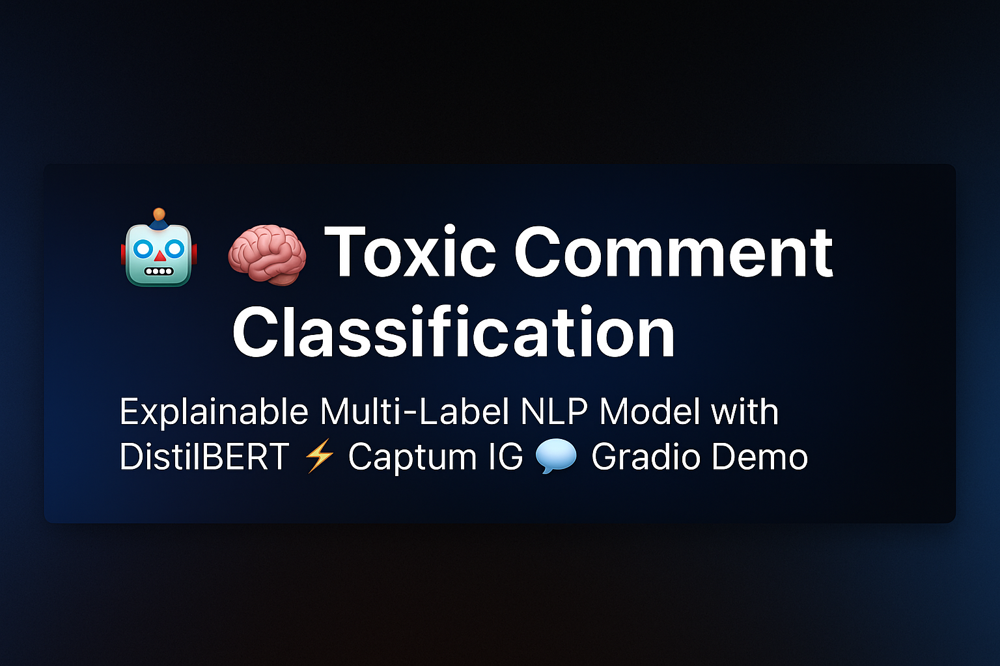

<p align="center">
  
</p>

# Explainable Toxic Comment Classification using DistilBERT

This project implements an **explainable multi-label toxic comment classification system** using the **DistilBERT** transformer model.  
It is based on the [Jigsaw Toxic Comment Classification Challenge](https://www.kaggle.com/datasets/julian3833/jigsaw-toxic-comment-classification-challenge) dataset and predicts six forms of online toxicity while providing interpretable visual explanations using **Captum Integrated Gradients (IG)**.

---
## 🧪 Try It Live

You can try the interactive web app on Hugging Face Spaces:  
👉 [https://huggingface.co/spaces/YaekobB/Toxic-Comment-Classification](https://huggingface.co/spaces/YaekobB/Toxic-Comment-Classification)

---

## 🚀 Key Highlights

✅ Fine-tuned **DistilBERT** model on 6 toxicity labels  
✅ Handles **multi-label** text classification (comments can belong to multiple categories)  
✅ **Explainable AI (XAI)** with Captum to visualize token-level attributions  
✅ **Gradio-based UI** for real-time text classification and interpretation  
✅ Clean, reproducible **end-to-end Kaggle notebook**  

---

## 🧱 Project Structure

```
Toxic-Comment-Classification/
│
├── README.md                                   # Project overview and documentation
├── requirements.txt                            # Python dependencies
├── Toxic_Comment_Classification_full.ipynb     # End-to-end Kaggle notebook
├── demo/
│   └── app.py                                  # Gradio UI for local demo or Spaces
│

```

---

## ⚙️ Installation & Setup

### 1️⃣ Clone the repository
```bash
git clone https://github.com/yaekobB/Toxic-Comment-Classification.git
cd Toxic-Comment-Classification
```

### 2️⃣ Install dependencies
```bash
pip install -r requirements.txt
```

### 3️⃣ Run the Gradio demo
```bash
python demo/app.py
```

Access the local app at → [http://127.0.0.1:7860](http://127.0.0.1:7860)

---

## 🧩 Model Details

The fine-tuned model is available on Hugging Face Hub:

👉 [https://huggingface.co/spaces/YaekobB/Toxic-Comment-Classification](https://huggingface.co/spaces/YaekobB/Toxic-Comment-Classification)

To use the model locally, download the weights and place them inside:
```
artifacts/best/
```

---

## 📊 Model Performance

| Dataset | Loss | Macro F1 | Precision | Recall | ROC-AUC |
|----------|------|----------|------------|---------|----------|
| Validation | 0.0393 | 0.6818 | 0.6988 | 0.6691 | 0.9891 |
| Test       | 0.0401 | 0.6833 | 0.7202 | 0.6564 | 0.9906 |

---

## 🔍 Explainability Example

Explainability Heatmap

**Color legend:**  
🔴 *Red* — Words that **increase** the toxicity score  
🔵 *Blue* — Words that **decrease** the toxicity score  

Each word’s intensity reflects its contribution to the final prediction.

---

## 🧰 Tech Stack

| Category | Tools & Libraries |
|-----------|------------------|
| Framework | PyTorch, Transformers (Hugging Face) |
| NLP | DistilBERT |
| Explainability | Captum (Integrated Gradients) |
| Visualization | Matplotlib, Seaborn, WordCloud |
| UI / Deployment | Gradio, Hugging Face Spaces |
| Dataset | Jigsaw Toxic Comment Challenge |

---

---

## 🪪 License

MIT License © 2025 
You are free to use, modify, and distribute this project with proper attribution.
